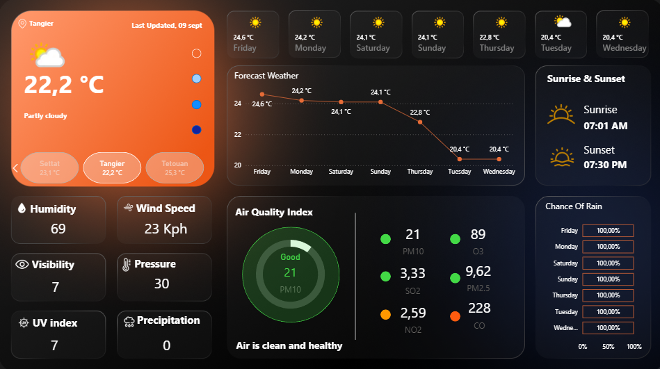
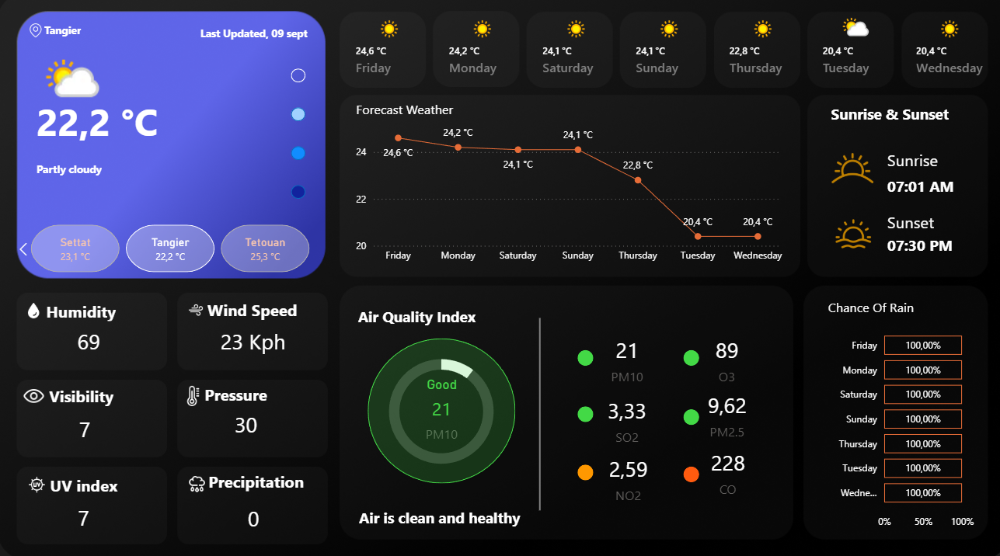
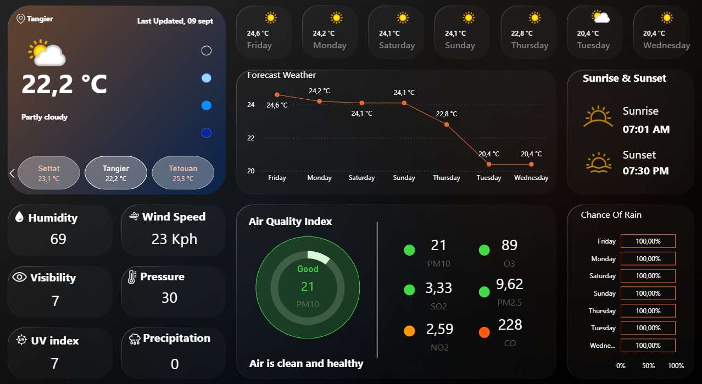
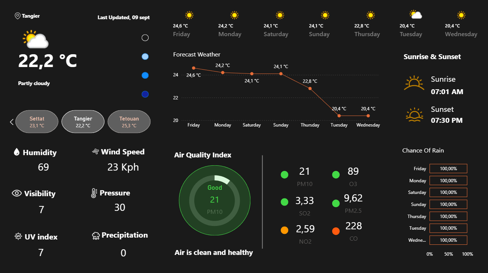

# Power BI Weather Analysis — Morocco

An interactive Power BI dashboard analyzing weather patterns across Morocco, built by connecting to a live public API, modeling the data into a star schema, and writing DAX measures to surface trends across cities, seasons, and climate variables.

## Dashboard

## The Project

The dashboard answers four core questions about Morocco's climate:

- What are the average monthly temperature and precipitation trends across the country?
- How do weather patterns differ between major cities — e.g. coastal Rabat vs. inland Marrakech?
- What is the correlation between humidity, wind speed, and temperature?
- Which months see the highest average UV index and the most rainfall?

## Tools & Data

| | |
|---|---|
| **Tool** | Microsoft Power BI |
| **Data source** | [WeatherAPI.com](https://www.weatherapi.com/) (live public API) |
| **Data cleaning** | Power Query — parsed JSON API responses, handled missing values, and converted data types (e.g. text to date/time) |
| **Data modeling** | Star schema with a central fact table (weather readings) and dimension tables (date, location) |
| **Visualization** | DAX measures for time-intelligence calculations (e.g. Year-over-Year change) and KPI cards |

## What I Learned

- Full-cycle BI development: from connecting to a live API through to a finished, interactive dashboard
- Data cleaning and transformation in Power Query, specifically handling nested JSON responses
- Writing DAX measures for time-based KPIs and comparative analysis
- Data storytelling — arranging visuals to guide a viewer toward clear, actionable insights
